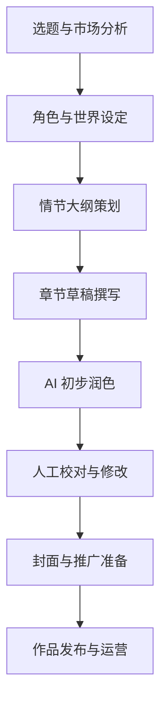

# 执行摘要 
本文针对网络小说创作提出了一套系统的“AI蒸馏”方法论。方法包括从选题构思到角色、世界观设定，再到情节大纲、章节撰写和语言风格优化等各环节，明确了人工与AI的分工及输入/输出形式；同时提供了完整的创作模板（角色档案、世界观、势力关系、时间线、关键情节点、主题/情感曲线、风格词表、章节大纲等）表格，便于工作室成员填充使用；并设计了小团队的工作流程（包含岗位分工、工具与提示示例、质量控制与验收标准）及甘特图/流程图；针对“去AI化”给出具体技术和写作策略；以知名网络作家天蚕土豆的风格为例，分析AI写作痕迹并给出前后改进示例；最后推荐了适用的AI模型、插件和资源（优先中文官方资料）。各部分内容均引用了网络文学平台和作者经验等资料支撑，确保方案具有可操作性和前沿性。

## 方法论步骤 
1. **选题与市场调研**：首先确定故事题材和市场定位。人工作为主导提出创作方向（如玄幻、仙侠），AI辅助拓展创意。  
   - **人工任务**：分析起点等平台的热门题材，确定题材类型。  
   - **AI任务**：根据提示（如“生成5个适合当前读者的玄幻小说主题”）输出题材建议列表。  
   - **示例**：输入提示`“生成5个新颖玄幻小说题材构思”`；AI输出示例包括如“天命重生类”、“异世修真类”等主题。  
   - **输出**：选择题材并形成概念框架。此时可借鉴作者经验：先“**头脑风暴**”故事原型、主人公和世界观，初步构想角色、背景和主要冲突。  

2. **角色与世界观构建**：基于选题完善主要角色和世界设定。  
   - **AI任务**：在提示中让AI生成角色原型（姓名、背景、性格等）或世界元素（例如“设计一个斗气大陆的魔法系统设定”）。  
   - **人工任务**：筛选AI输出、补充细节并使信息一致。  
   - **输入/输出示例**：提示如`“生成男主角姓名、出身和主要目标”`；AI输出如“李毅，贫寒世家出身，目标复仇洗清冤屈”。  
   - **输出**：形成完整的角色档案和世界观概要。  

3. **情节大纲策划**：梳理故事主线和节奏，将作品分成若干部分。  
   - **AI任务**：根据已有设定生成章节概要或情节节拍（beat sheet）。可提示“使用四幕结构”为故事生成主要事件。  
   - **人工任务**：参考AI建议，制订详细大纲，确保逻辑连贯。经验指出：**小说大纲应包括故事主线、主人公的主要行动及结局**。例如一个建议是按**四幕剧结构**并使用“拯救猫节拍”（Save the Cat）来设计关键节点。  
   - **输入/输出示例**：输入提示`“根据四幕结构写出故事主线概要，每幕包含关键冲突”`；AI输出分幕大纲。  
   - **输出**：形成含各幕或各章节要点的完整大纲。如某步骤引用：大纲需明确主人公、主要事件和结局；Rogerson也建议按四幕分解并列出关键情节点。  

4. **章节创作与语言风格**：以大纲为基础逐章撰写正文。  
   - **AI任务**：辅助起草章节或场景：可提示AI生成对话、战斗描写或环境描述。如“描写主角第一次觉醒斗气的场景”。AI给出文本后再由人工润色。  
   - **人工任务**：编写或修改章节，注重语言风格、情感流畅和文化细节。人工要对AI生成内容进行增补和校正，避免生硬重复。  
   - **输入/输出示例**：输入提示`“写一段主角初战时的激烈打斗场面，风格参考天蚕土豆”`；AI输出场景段落后，人工进一步润色语言、增加细节和创意。  
   - **输出**：连贯且有吸引力的章节正文。人工需要重点把控节奏、语言特色和情感曲线。  

5. **发布与读者运营**：完成修订后的作品发布和后续推广。  
   - **AI任务**：辅助生成宣传文案、封面设计思路、读者互动话题等。例如用AI设计一段标题和简介，或根据章节内容生成社交媒体宣传文案。  
   - **人工任务**：审核和修改AI建议，最终提交作品，并通过微博、公众号等渠道运营粉丝、回复评论、做互动活动。  
   - **输入/输出示例**：提示`“为XX小说生成一条吸引人的公众号推送摘要”`；AI提供文案，人工编辑优化。  
   - **输出**：作品发布页、推广文本等。运营阶段人工主导，AI辅助内容生成与分析（如用AI统计关键词或读者偏好）。  

以上步骤强调人机协同：**AI主要负责生成创意素材、内容提案和辅助润色，作者/团队负责决策、原创性补充和质量把控**。例如，在头脑风暴和大纲阶段AI输出思路，人类选取加工；在写作阶段AI可提供初稿片段，人类润色定稿。 

## 创作模板（可复制填写） 
**角色档案**：  
| 字段       | 内容说明         | 示例         |
|------------|------------------|--------------|
| 姓名       | 角色姓名         | 李拓         |
| 年龄       | 年龄或外貌年龄   | 18岁        |
| 身份/背景  | 出身、职业、修为等 | 小村少年，练气期 |
| 性格特征   | 性格、优缺点     | 冲动仗义      |
| 能力/技能  | 战斗力、特殊能力 | 精通剑术，控火能力 |
| 目标/动机  | 人物追求和目标   | 复仇、保护家人  |

**世界观设定**：  
| 字段         | 内容说明             | 示例           |
|--------------|----------------------|----------------|
| 世界名称     | 故事发生的世界/国家名 | 铁血大陆       |
| 时代背景     | 历史时期、社会环境   | 玄幻时代，门派林立 |
| 主要文明/宗派 | 文化或修炼体系       | 剑宗、丹宗、武道会 |
| 主要规则     | 如魔法法则、斗气规则 | 斗气有五行属性     |

**势力关系**：  
| 势力/组织 | 类型/背景       | 主要人物  | 目标/动机         |
|----------|---------------|-----------|-----------------|
| 苍玄门   | 正派门派       | 祖师林烈 | 守护大陆，晋升武道顶峰 |
| 魔煞教   | 反派教团       | 教主冥幽 | 征服天下，复仇人族   |
| 商会     | 中立商帮       | 会长唐天 | 控制稀世资源       |

**时间线**：  
| 时间      | 事件概要               |
|----------|------------------------|
| 0年前夕   | 天才少年李拓出世         |
| 10年前   | 铁血大陆遭魔煞教血洗，苍玄宗危机四伏 |
| 现在     | 李拓入门试炼，踏上复仇之路     |

**关键情节点**：  
| 序号 | 事件描述             | 影响/结果               |
|-----|---------------------|-----------------------|
| 1   | 主角进入门派       | 学得第一招擒龙拳，结识师兄   |
| 2   | 门派遭袭，师父受伤 | 主角悲愤觉醒“焚天诀”，战力暴增 |
| 3   | 大战魔煞教核心     | 主角突破极限，逆天重生      |

**主题/情感走向**：  
| 情节阶段 | 主要主题与情感             |
|--------|-------------------------|
| 开端    | 逆境中的成长、仇恨与团结  |
| 发展    | 修炼突破、友情支持        |
| 高潮    | 生死搏杀、舍身为人        |
| 结局    | 复仇与救赎，新的开始      |

**语言风格词表**（可参考）：
| 词语/修辞   | 说明             |
|------------|------------------|
| 符箓、丹药 | 修炼相关名词常用 |
| 绵延青山   | 环境描写常用     |
| 狂啸、怒视   | 表现战斗状态     |
| 晴空骤雨   | 气氛对比修辞     |

**章节大纲**：  
| 章节   | 标题（可定）    | 概要                               |
|-------|---------------|----------------------------------|
| 第一章  | 少年入门       | 主角李拓拜入苍玄门，展示天赋，结识伙伴。  |
| 第二章  | 杀入夜袭       | 魔煞教突袭，主角奋力抗敌，伤师父觉醒新力。 |
| 第三章  | 逆转与突破     | 李拓不屈学习焚天诀，在比试中战胜大敌。    |
| ……    | ……            | ……                                 |

## 工作流程与岗位分工 
**团队分工：** 小型工作室一般可按职责划分：  
- **策划/作者**：确定选题、构思大纲和人设，用AI工具辅助头脑风暴，并负责最终撰写和润色文章。  
- **AI工程师/提示工程师**：负责搭建或配置写作AI模型和插件，根据创作需求设计提示词（Prompt），执行AI生成文本、检索信息或撰写辅助内容。  
- **编辑/校对**：审核章节草稿，检查逻辑、情节连贯性与语言质量，对AI生成内容进行人工润饰和统一风格。  
- **运营/美工**：负责封面设计、章节封面、宣传文案撰写及读者互动。可使用AI生成封面草图、宣传图文，再由美工与运营负责修改发布。  

**工具清单：** 常用工具包括：  
- **AI模型**：ChatGPT/GPT-4 (OpenAI)、文心一言(百度)、ChatGLM(智谱)、Qwen(阿里)等用于文本生成和辅助；  
- **写作软件**：Scrivener 或起点作家助手等用于组织大纲和章节；  
- **协作平台**：Git、Google Docs、为知笔记等用于版本管理和多人协作；  
- **提示工程平台**：例如 Flowise、LangChain 等，用于构建多步提示或集成检索。  

**提示工程示例：**  
- 场景提示：`“设定一位剑修弟子初入宗门的场景，包括他拜师、试炼和第一次使用剑气。”`  
- 角色提示：`“生成三位配角的信息：姓名、身份、技能、与主角的关系。”`  
- 风格提示：`“请用天蚕土豆文风，描述一场热血的山崖对决。”`  

**质量控制与迭代验收：**  
- 每完成一章，团队进行审读，重点检查**情节连贯性**、**角色动机逻辑**、**风格一致性**、**语法错别字**等；  
- 使用AI检测工具（如GPTZero等）评估文本AI痕迹，确保语言多样化；  
- 建立评审标准，如情节流畅度打分、读者反馈收集等；每轮修改后更新文档并记录版本。  
- 迭代过程中，标题筛选与章节节奏由市场数据和读者反馈共同指导，实现“AI辅助创作 + 人工迭代优化”的闭环。

## 避免AI写作痕迹的策略 
- **多样化句式**：避免所有句子都遵循同一模板；可以主动打断AI输出的格式，使用长短句结合，穿插问句或省略句。  
- **个性化细节**：增加角色的独特举动或方言口头禅。举例在对话中插入符合角色个性的称谓或俚语，避免千篇一律。  
- **丰富描写**：加入比喻、拟人等修辞，如将环境、物品拟人化，创造生动画面。比如不用仅“天空阴沉”，而用“乌云低垂，仿佛预兆着风暴”。  
- **情感与内心描写**：适当插入角色内心活动描写，让文字不只是叙述事件，还表达情绪。AI往往偏向客观叙述，增加内心感受和心理变化可降低AI感。  
- **语气和语域**：根据情节使用恰当语气（急促、平缓、激昂）和文体（古风用词或现代用语）。可在提示中指定，如“以文言文和白话文混合的风格写一段”来增加多样性。  
- **人工干预**：即使AI写作质量高，也需要人工进行多轮润色。将AI产出视为草稿，通过人工调整词汇、句式及节奏，去除机械重复和逻辑瑕疵。  

## 天蚕土豆风格示例分析 
下列示例展示了典型的AI生成风格与人工改进后的对比。**改进前（AI风格）**段落结构比较机械，情景描写偏通用；**改进后**通过细节和修辞增强了画面感和代入感。

- **改进前（AI示例）**：林动双目微眯，猛地爆喝一声，抬手斩出，剑气如雷霆般吼叫而出。王杰大怒，一掌拍出，护体青龙劲气迎接，两股力量碰撞激起震天魔音，轰然炸裂。林动气势更盛，剑光骤烈，连出三剑，将王杰逼退数步。王杰手中魔刀横扫，将最后一剑格开，紧接着身形一闪躲过林动的冲锋。  
- **改进后（人工优化）**：林动忽然反手，剑尖霎时寒光暴涨，如晨曦破晓劈开长空。他怒吼一声，血红剑光随之斩出。王杰勃然大怒，双掌结印，**青龙护体**劲气骤起。两股劲气狂烈相撞，顿时天地色变，仿佛战鼓雷鸣般震颤四方。林动身形如电，连斩三剑，如疾风骤雨般席卷王杰。王杰尘土飞扬中后退，奋力格挡最后一击。  

上述改进使用了更多细节和比喻（如“晨曦破晓”、“战鼓雷鸣”），丰富了场景和节奏，去除了原文略显平铺直叙的叙述，削弱了“AI痕迹”。

## 推荐模型、插件与资源 
- **中文大模型**：推荐使用面向中文的主流大模型，如**智谱清言ChatGLM**系列（开源模型，已在 Hugging Face 发布，支持中英双语）、百度**文心一言(ERNIE)**、阿里**Qwen**系列、华为**盘古系列**等。这些模型在中文内容生成上表现出色。  
- **英文大模型**：可使用**OpenAI GPT-4/ChatGPT**或**Anthropic Claude 3**等，通过详细提示也能较好地生成中文内容。  
- **AI写作工具**：起点作家助手、文心一格等专业写作辅助平台可结合AI功能使用；Scrivener、WPS等写作软件用于大纲和整理。  
- **插件和集成**：可使用LangChain、Flowise等框架搭建定制化写作管道；ChatGPT插件商店中已有“写作助手”、“灵感链”类插件可供试用。  
- **资源文档**：参考各模型**官方文档**和**教程**，如ChatGLM官方资料、OpenAI提示词指南；参与中文写作社区（起点作者专区、知乎、公众号等）讨论，获取最新经验和技巧。  

**参考资料：** 网络写作经验总结提供了对创作大纲和流程的启示；最新AI模型介绍说明了ChatGLM等中文AI模型的能力和开放性。以上方法和工具可直接应用于小型写作工作室，形成高效的“AI蒸馏”小说创作流水线。